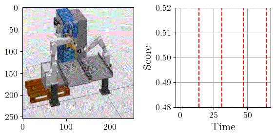
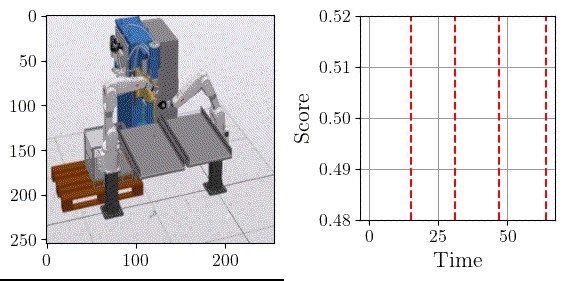

# Model-based Robust Representations through Multimodal Fusion: Leveraging Intermodal and Intramodal Correlations

Minimizing unexpected disruptions in industrial environments is vital due to the steep costs tied to energy waste, idle labor, and resource inefficiencies. Traditional predictive maintenance techniques are useful for handling wear-and-tear over time, but they often fall short when it comes to spontaneous, unpredictable failures.

This repository presents a deep learning solution called the Multimodal Concept Fusion Architecture — a framework specifically built to handle diverse, noisy, and incomplete data from multiple sources. Instead of relying on a single unified representation, the model intelligently combines features from different data types by learning an abstract “fusion concept” that dynamically adjusts between shared and unique modality signals.

The architecture not only detects anomalies as part of its core functionality but also provides insight into the reasoning behind its predictions by attributing outcomes to specific data channels. This enhances interpretability and fosters trust in automated decision-making.

### 🚨 Anomaly Detection via Concept Scores

Anomaly detection in our framework is performed using the **concept scores** derived from the unified latent representation. After fusing modality-specific embeddings into the shared concept vector $\mathbf{z}_c$, we compute a **concept score** that quantifies which aggregation function is used with the learned concept space. High concept scores indicate joint information, and low scores indicate marginal information. This allows the model to detect irregularities, enhancing robustness in real-world industrial scenarios. The failure injection is based on our pre-work [1].

<p align="center">
  
</p>

<p align="center">
  
</p>

### 📦 Prerequisites

Before you begin, ensure your environment meets the following requirements:

* **Python** ≥ 3.6
* **PyTorch** ≥ 1.0 (CUDA support recommended for faster training)

We also recommend using a virtual environment (e.g., `venv` or `conda`) to avoid package conflicts.

## 🔗 Multimodal Robot Kinematic Datasets

This repository provides access to three multimodal robot movement datasets, each including at a minimum the **camera** and **kinematics** modalities. For detailed descriptions of the datasets, data collection procedures, and experimental use cases, please refer to our paper [2]:

**"Performance benchmarking of multimodal data-driven approaches in industrial settings"** – [Link to Paper](https://www.sciencedirect.com/science/article/pii/S266682702500074X?via%3Dihub)

1. **MuJoCo: UR5 Robot Motion** – [Link to Dataset 1](https://zenodo.org/records/14041622)
2. **ABB Studio: Single Robot Welding Station** – [Link to Dataset 2](https://zenodo.org/records/14041488)
3. **ABB Studio: Dual Robot Welding Station** – [Link to Dataset 3](https://zenodo.org/records/14041416)

Each dataset captures robot motion across various tasks and environments, providing synchronized data streams for machine learning and robotics research.

## 📌 Citation
If you use this code or build upon our work, please cite our paper:


```bibtex
@article{altinses2025XXX,
  title={Empty},
  author={Altinses, Diyar and Andreas, Schwung},
  journal={Empty},
  volume={XX},
  number={XX},
  pages={XX--XX},
  year={XXXX},
  publisher={IEEE}
}
```


## 📚 References 

This project builds on concepts from multimodal representation learning, attention-based fusion, and anomaly detection in industrial systems. Below are selected related works and projects that inspired or complement this research:

<a id="1">[1]</a> Altinses, D., & Schwung, A. (2023, October). Multimodal Synthetic Dataset Balancing: A Framework for Realistic and Balanced Training Data Generation in Industrial Settings. In IECON 2023-49th Annual Conference of the IEEE Industrial Electronics Society (pp. 1-7). IEEE.

<a id="2">[2]</a> Altinses, D., & Schwung, A. (2025). Performance benchmarking of multimodal data-driven approaches in industrial settings. Machine Learning with Applications, 100691.

<a id="3">[3]</a> Altinses, D., & Schwung, A. (2023, October). Deep Multimodal Fusion with Corrupted Spatio-Temporal Data Using Fuzzy Regularization. In IECON 2023-49th Annual Conference of the IEEE Industrial Electronics Society (pp. 1-7). IEEE.


